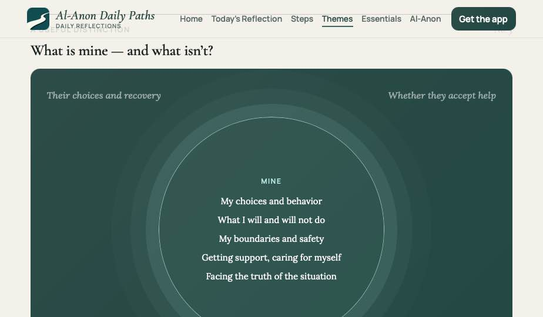
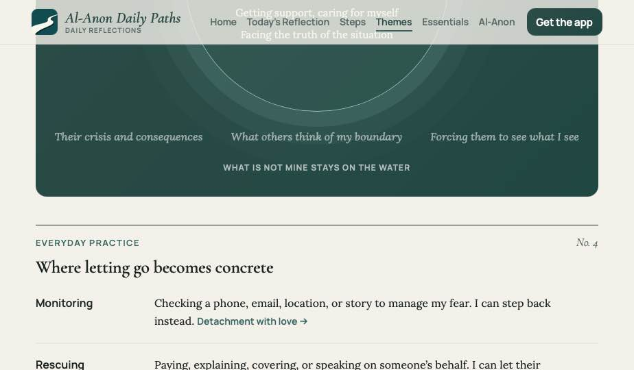

# Theme page template — architecture and spec

The redesign of `/themes/letting-go-of-control/`, generalized into **one template for all
twelve reading-collection themes**.

Live page it replaces: <https://dailypaths.org/themes/letting-go-of-control/>
Prototype: `../prototype/Letting Go Redesign.dc.html` (open in a browser)
Screenshots: `screenshots/`

---

## 1. What was wrong with the live page

The copy is good. The problem is that **every idea got its own container**. In one article:
prose sections, a truth callout, a manipulation-mirror aside (with a full-size `<h2>` inside
it), a mine/not-mine grid, a scenarios grid, a practice section, and a `<details>` accordion
— plus two pull quotes at equal weight.

Consequences:

- **No subordination.** Everything is a peer, so nothing reads as the main point.
- **Repetition across containers.** Monitoring / rescuing / rehearsing appeared in three
  different boxes.
- **Two competing pull quotes**, so neither is the thesis.
- **Box fatigue.** Boxes stop meaning "this is special" when most of the page is boxed.
- **Nothing generalizes.** The next eleven theme pages would each invent their own layout.

**The fix is not shorter copy.** All the original content survives. The fix is a fixed
vocabulary of elements with a defined rank, applied the same way on every theme page.

## 2. Architecture — the element vocabulary

Six element types. **A theme page may use only these.** If a new idea needs a new element,
change the template for all twelve pages, not one page.

| Rank | Element | Rule |
|---|---|---|
| 1 | **Hero** | Photo + scrim. Eyebrow "RECOVERY THEME" · H1 theme name · one-line definition |
| 2 | **Lede** | First paragraph, larger and in `--accent-strong`. Exactly one |
| 3 | **Thesis quote** | Centered Cormorant italic between two full-width teal rules. **Exactly one per page** |
| 4 | **Chapter** | Numbered folio + eyebrow + H2 + Lora prose. Four per page |
| 5 | **Takeaway** | The last line of a chapter, plain italic Lora, inline. At most one per chapter |
| 6 | **Figure** | The one visual per page. On this page, the circle diagram |

Plus two **shared panels** carried over unchanged from the Step-detail template (they must
look identical there and here): the seafoam practice panel, and the readings grid.

### The chapter spine

Four chapters, in this order, with **fixed eyebrow labels reused on every theme page**:

| No. | Eyebrow | Job |
|---|---|---|
| 1 | WHAT IT MEANS | The definition, positively stated |
| 2 | WHAT IT IS NOT | The misreading, corrected |
| 3 | A USEFUL DISTINCTION | The figure — the page's one diagram |
| 4 | EVERYDAY PRACTICE | Where the idea becomes concrete |

The fixed labels are the cross-page cohesion: a reader who has read one theme page knows the
shape of all twelve, and the eyebrow tells them where they are.

**Folio treatment:** 1px `--text-primary` rule across the measure; below it, the eyebrow in
Manrope 600 / 13px / **1.4px tracking** / uppercase / `--accent` on the left, and `No. 1` in
Cormorant italic 17px `--text-muted` on the right. This is the editorial device that makes
the page read as a magazine feature rather than a help article.

### Scan layers

A reader who scans should collect the argument from three levels, in this order:

1. **Lede** — the emotional entry ("I've spent so long trying to prevent disaster…")
2. **Thesis quote** — the single memorable line
3. **Takeaways** — one nugget per chapter, italic, at the end of the prose

Everything else is prose for the reader who actually reads. **Never** promote a takeaway into
a boxed callout; it competes with the thesis quote and re-creates the original problem.

### Rules that keep it from degrading

- One thesis quote. One figure. One lede. Per page.
- Prose lives in chapters. Structured content lives in the figure. Program actions live in
  the shared panels.
- **No element style may appear only once on the site.** If a treatment isn't reused across
  theme pages or shared with the Step template, delete it.
- Inline links inside prose (not link boxes) carry readers to individual readings.

## 3. The figure — circle on the water




Chapter 3's diagram, and the page's one "special" moment. **"Mine vs not mine" is not a
one-to-one comparison** — two side-by-side columns falsely imply row pairing, which is why
the table version was rejected. The circle solves it: it's a containment diagram, not a
comparison.

- Panel: `--hero-gradient`, radius 16, generous padding. The only dark block on the page.
- **The circle** is centered: `clamp(250px,60vw,330px)`, `aspect-ratio: 1`, 1px
  `rgba(186,236,230,.75)` border, fill `rgba(186,236,230,.07)`, with three concentric ripple
  rings drawn as stacked `box-shadow` spreads (22px/.09, 48px/.045, 80px/.02) — the app's
  ripple motif.
- **Inside:** eyebrow "MINE" in seafoam `#BAECE6`, then the five things that are yours, Lora
  15/23, white.
- **Outside:** the not-mine items scattered above and below on the dark water, Lora *italic*
  16px at `rgba(255,255,255,.55)` — literally outside your circle, unanchored, quieter.
- **Caption:** "WHAT IS NOT MINE STAYS ON THE WATER", 12px uppercase, 1.2px tracking.

**The diagram is the lesson.** Inside the ring is the only thing you tend; everything else
floats.

**Generalizing it:** every theme page gets one circle figure with its own inside/outside
pairing (Boundaries: what I control / what I can only request. Detachment: my conduct / their
reaction). If a theme has no honest inside/outside pair, it gets a different single figure —
never two figures, never zero.

## 4. Page order

```
sticky header
theme rail            prev theme · All Themes · next theme
hero                  photo + scrim
─ 820px article ─
lede
thesis quote          between two teal rules
chapter No. 1         WHAT IT MEANS        → takeaway
chapter No. 2         WHAT IT IS NOT       → takeaway
chapter No. 3         A USEFUL DISTINCTION → the figure
chapter No. 4         EVERYDAY PRACTICE    → label/prose rows
practice panel        seafoam, numbered steps   (shared with Step pages)
─ 1160px ─
readings grid         4 cards, each labelled with its Step
sources note          13px muted + independence disclaimer
app CTA               seafoam panel
footer                teal, 988 crisis line
```

## 5. Type and color, as built

Everything resolves to design-system tokens. No new values.

| Element | Spec |
|---|---|
| H1 | Cormorant 500, `clamp(34px,4.6vw,58px)`, −0.8px, on scrim |
| Lede | Lora, `clamp(20px,2vw,23px)`/1.55, `--accent-strong` |
| Thesis quote | Cormorant italic 500, `clamp(24px,2.8vw,34px)`/1.45, centered, max 36ch, `--accent-strong`, 1px `--accent-strong` rules above and below |
| Chapter eyebrow | Manrope 600, 13px, 1.4px tracking, uppercase, `--accent` |
| Folio number | Cormorant italic 17px, `--text-muted` |
| Chapter H2 | Cormorant 600, `clamp(25px,2.8vw,32px)`, −0.3px |
| Body | Lora `clamp(17px,1.5vw,18.5px)`/1.66, 20px gaps |
| Takeaway | Same as body, `font-style: italic`, no border, no color change |
| Row label | Manrope 600 16px (Everyday practice), grid `minmax(110px,150px) 1fr` |
| Measure | 820px article, 1160px full-width sections |

## 6. Building it

**Content model.** A theme page is data, not bespoke HTML:

```json
{
  "slug": "letting-go",
  "title": "Letting Go",
  "definition": "Caring without carrying — releasing the need to manage, fix, or control.",
  "hero": "themes-hero.jpg",
  "lede": "…",
  "thesis": "Letting go respects another person's dignity: …",
  "chapters": [
    { "eyebrow": "What it means", "heading": "Love without taking over",
      "body": ["…"], "takeaway": "It is not my job to break through their denial. …" }
  ],
  "figure": { "caption": "What is not mine stays on the water",
              "inside": { "label": "Mine", "items": ["…"] },
              "outside": ["…"] },
  "practice": [{ "lead": "Name it.", "rest": "…" }],
  "readings": [{ "step": "Step One", "date": "January 7", "title": "…" }]
}
```

Render the four chapters from the array — the folio numbers are `$index + 1`, never authored.

**Validation worth enforcing in the build:** exactly one thesis, ≤1 takeaway per chapter,
exactly one figure, exactly 4 chapters with the canonical eyebrows.

## 7. Notes and open items

- **Hero photography.** The prototype uses a landscape. Several live theme photos contain
  people; the design system's imagery rule is **no people, no faces**. Reshoot or reassign
  from the reflections library.
- **Nav.** The prototype keeps the live site's six-item nav so it drops into today's site
  unchanged. When the consolidation ships (`../CHANGES.md`), this page moves under **Topics**
  and the rail says "All topics".
- **Naming.** The consolidated structure renames Themes → Topics and merges this theme with
  the old Powerlessness & Surrender. Page title becomes "Letting Go"; slug should become
  `/topics/letting-go/` with a redirect from `/themes/letting-go-of-control/`.
- **Reflection questions were removed** — they duplicated the practice panel's job.
- **"Caring and carrying are not the same thing"** was cut from this page; it belongs on
  *Helping or Enabling?*
- Sources note stays at the foot: literature titles italicized, plus the independence
  disclaimer. Do not quote Al-Anon literature at length without permission.

## 8. Screenshots

| File | Shows |
|---|---|
| `01-hero.png` | Header, theme rail, photo hero |
| `02-lede-and-thesis-quote.png` | Lede, thesis quote between rules, chapter No. 1 folio |
| `03-chapter-2.png` | Chapter No. 2 and its inline italic takeaway |
| `04-circle-figure-top.png` | The figure — circle, ripples, inside items |
| `05-circle-figure-bottom.png` | Outside items on the water, caption, chapter No. 4 rows |
| `06-practice-panel.png` | Seafoam practice panel (shared with Step pages) |
| `07-readings-cta-footer.png` | Readings grid, sources note, app CTA, footer |
